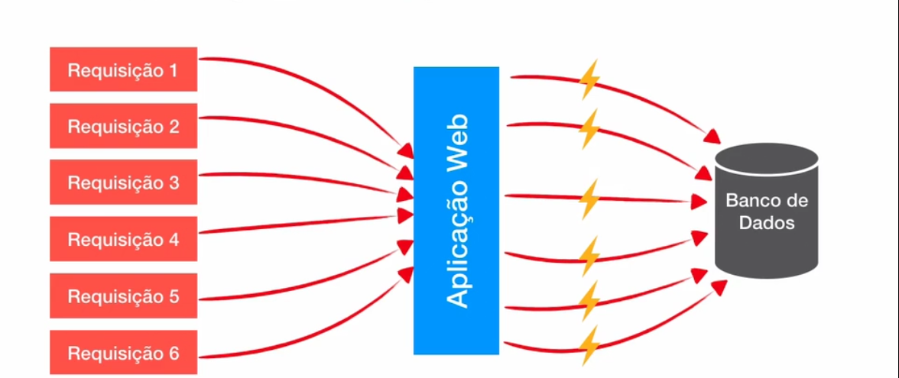

# FoodNow

### Earger Loading
Por padrão todas as associações que terminam com `ToOne` são earger (ansioso), o que significa que mesmo que a propriedade, anotada com `@ManyToOne`, não seja utilizada, 
a propriedade deve ser carragada. Fica a cargo da implentação do JPA lidar com esse carregamento, realizando vários `SELECT` ou por meio de `JOIN`.

### Lazy Loading
Por padrão todas as associações que termina com `ToMany` são lazy, Ao contrário do Eager Loading, o lazy loading é um carregamento por demanda, apenas quando solicitado.

### Aplicação Sem pool de conexões
para cada <b>nova requisiçao</b> será aberto uma nova conexão com banco de dados e após ser atendida a conexão é <b>fechada</b>.

### Aplicação Com Pool de conexões
O pool de conexões é basicamente um software/biblioteca que mantem um conjunto de conexões prontas (quantas definidas)
para ser reutilizado nas requisições, não tendo necessidade de abrir e fechar uma nova conexões para cada requisições.
Caso alguma das conexões fique ociosa, ela fica no estado de IDLE esperando uma nova requisição para utilizar essa conexão.

É possível que se houver mais requisições do que conexões disponíveis e o pool de conexões
estiver configurado, criará novas conexões, porém caso atinja o máximo de conexões, alguma das processos para utilizar a 
conexão ficar em uma "fila"

